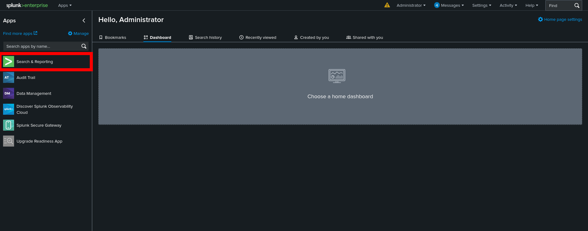
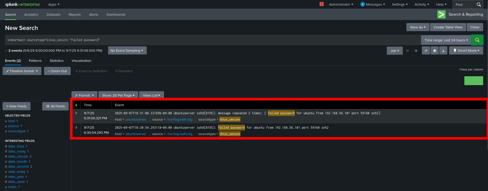
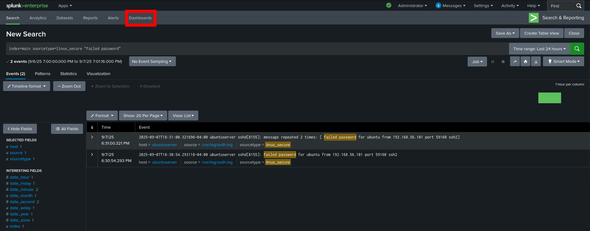

# Splunk + SSH Brute-Force Detection Lab (Kali -> Ubuntu)
This guide documents a mini SOC lab project where you set up a Splunk server on Ubuntu, ingest SSH logs, simulate a brute-force attack using Hydra from Kali, and anlyze the events Splunk.

## 0) Lab Topology
- **Ubuntu Sever:** Splunk installed + SSH target
- **Kali Linux:** attacker VM with Hydra

**Network mode:** Both VMs should be on the same **NAT Network** (or Bridged).

Verify IPs on both VMs (will need them later):
```bash
ip a 
```

___

## 1) Prepare Ubuntu (target + Splunk indexer)

```bash
sudo apt update
sudo apt install -y curl wget openssh-server
sudo systemctl enable --now ssh

#Allow SSH in firewall (ufw)
sudo ufw allow ssh
```
Confirm access from Kali:
```bash
ping <UBUNTU_IP>
ssh <ubuntu_user>@<UBUNTUIP>
```
___
## 2) Install Splunk on Ubuntu
Create a free Splunk account an go to the Splunk download page:
https://www.splunk.com/en_us/download.html

Navigate to Linux -> .deb install

Hover over the wget link and copy the command


In Ubuntu, run:
```bash
cd /tmp
# Paste the wget command (example shown)
wget -O splunk-10.0.0-xxxxxxxxxx-linux-amd64.deb "https://download.splunk.com/products/splunk/releases/10.0.0/linux/splunk-10.0.0-xxxxxxxxxxxxx-linux-amd64.deb" 
sudo dpkg -i splunk.deb

# First-time setup
sudo /opt/splunk/bin/splunk start --accept-license

# Optional auto-start
sudo /opt/splunk/bin/splunk enable boot-start -user splunk

# Verify Splunk status
sudo /opt/splunk/bin/splunk status

# Useful commands
sudo /opt/splunk/bin/splunk start
sudo /opt/splunk/bin/splunk stop
sudo /opt/splunk/bin/splunk restart
```
***Splunk Web Interface***

Splunk Web: https://<UBUNTU_IP>:8000

---

## 3) Ingest Logs

Now that we have Splunk running, we need it to watch over certain high profile directories and files. For this lab, we will be monitoring the auth.log file primarily to see the SSH attack. Meanwhile syslog is Linux's main logging system that looks over the kernel, background services, and applications, so having it in our SIEM is important as well.

```bash
sudo /opt/splunk/bin/splunk add monitor /var/log/auth.log -sourcetype linux_secure -index main

sudo /opt/splunk/bin/splunk add monitor /var/log/syslog -sourcetype syslog -index main
```
---

## 4) Splunk Starting Point
We are going to be switching over to the Splunk web session now! Use the IP address for your Ubuntu server from before and enter this into your web browser.

**https://<UBUNTU_IP>:8000**

After logging in, navigate to the **Search & Reporting** tab in the left side Apps pane.



Now lets make our first search, in the search bar, type the filter:

```spl
index=main sourcetype=linux_secure "Failed password"
```


After hitting search, we can see that there are **no logs yet** in the sourcetype "linux_secure" (which if we remember, points back to the auth.log file). Don't stress, because we haven't tried using SSH into the server so there aren't any logs to be caught yet. **lets create some!**

## 5) Log Creation

In the Kali terminal, attempt to SSH into the server. This time we are going to type the password **wrong** for all the attempts.

```bash
ssh <ubuntu_user>@<UBUNTUIP>
```


Now we can go back to Splunk's search and enter:

```spl
index=main sourcetype=linux_secure "Failed password"
```
Now we can see the **newly created** logs in Splunk!



Take a quick look at them and think about what you see:

What IP address is shown?

What are the highlighted sections?

Is there a time for the event?

These logs show **key** information about security events on the server. For security professionals, a good SIEM is the first line of investigation when critical events occur.

Lets *raise the bar* and get a little more in depth

## 6) Dashboard Creation
So we don't have to keep searching, lets create an automated alert. In the search bar, search:

```spl
index=main sourcetype=linux_secure "Failed password"
| rex "from (?<src_ip>\d{1,3}(?:\.\d{1,3}){3})"
| bucket _time span=5m
| stats count as failures by _time, src_ip
| where failures >= 5
```
This alert documents failed SSH password attempts by ip address, five minute time intervals, and more than five attemps failed.

Now look at the top left of the screen and hit **"Save As"** then **"Alert"**


Make the name of the alert anything you'd like and hit **Save**.

Now we are going to create a dashboard, navigate to the **Ds** tab at the top of the page and find the **Create New Dashboard** green icon at the top right.



Name this new dashboard something along the lines of **SOC Lab Monitoring**, using the Classic Dashboards. Dashboard Studio is more complex, but for our first lab we'll use the easier Classic Dashboard.

At the top, click **+ Add Panel** -> **New From Report** -> and choose the brute force alert you created.

This will add the alert to your dashboard and get you ready for the final part of this lab.

## 7) Brute-Force Attack Simulation

Here we are going to be using a tool in Kali Linux named "Hydra". Hydra is a network cracking tool used by hackers to try to gain access to systems with a database of usernames and passwords.

Take a moment to check out some of Hydra's capabilities by using:

```bash
man hydra
```

Now you're ready for the attack, run these commands to start.

```bash
sudo apt update
sudo apt install -y hydra wordlists
sudo gzip -d /usr/share/wordlists/rockyou.txt.gz 2>/dev/null || true

# Run the attack!
hydra -l <ubuntu_user> -P /usr/share/wordlists/rockyou.txt -t 4 -f ssh://<UBUNTU_IP>

# We don't need to run all the way through for our SIEM alerts to show, so after a few minutes, exit out of the attack with '^C'.
```

